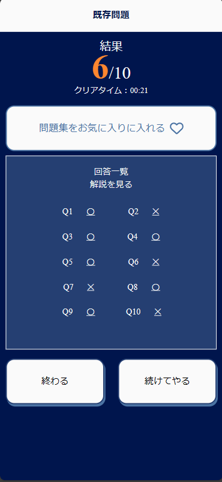

# Shikakue

  
  

## Overview

Shikakue is an application to support the study for the HTML5 qualification. It is designed to allow people who are busy with work and school to enjoy studying for qualifications in their spare time.

## Technology

This is a JavaScript project using npm. It is a web application using Express.js, and MySQL is used for data storage.

## Installation

1. Clone the repository: `git clone <https://github.com/SHIKAKUE-html5/SHIKAKUE.git>`
2. Install dependencies: `npm install`
3. Copy `.env.example` to `.env`and enter the environment variables.
4. Compile SCSS to CSS: `gulp sass`
5. Start the server: `npm start`

## Project Structure

The project has the following structure:

- `src/`: This is where the main application code resides.
  - `config/`: Contains configuration files such as `database.js`and`viewEngine.js`
  - `controllers/`: Contains controller files that handle incoming requests and send responses.
  - `models/`: Contains files that define the structure of data in the database.
  - `routes/`: Contains files that define the routes of the application.
  - `services/`: Contains files that define business logic.
  - `views/`: Contains files that define how the application's data is displayed to the user.
- `public/`: Contains static files such as CSS, JavaScript, and images.
- `sass/`: Contains SCSS files that will be compiled to CSS.
- `gulpfile.js`: Defines tasks to automate common development activities.
- `server.js`: The entry point of the application.

## Contribution

Contributions are welcome. Please fork the repository and create a pull request with your changes.
